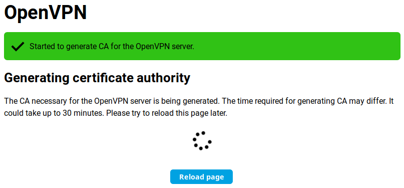
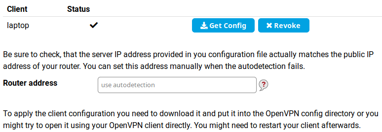

# OpenVPN server on Turris

Starting with Turris OS 3.6, you can configure OpenVPN easily through the Foris web interface.

## What is OpenVPN

[OpenVPN](https://en.wikipedia.org/wiki/OpenVPN) is an open technology for
[virtual private networks](https://en.wikipedia.org/wiki/Virtual_private_network). It works on the client-server
principle - multiple clients connect to an OpenVPN server to get access to a regularly inaccessible network.
For example, you can access computers in your home or office LAN from your laptop connected to any Internet connection.

The access is [authenticated](https://en.wikipedia.org/wiki/Authentication) (only permitted clients can connect to
the server) and [encrypted](https://en.wikipedia.org/wiki/Encryption) (nobody can read
the communication between the client and the server). Additionaly, your Internet traffic can be routed via
the OpenVPN connection (this is useful e.g. if your company's servers may be accessed only from the company's LAN).

!!! important
    You can use your Turris as an OpenVPN server only if it is accessible from the Internet (it has a public IP address
    or at least the OpenVPN port is forwarded to it).

## How to set up OpenVPN in Foris

This manual describes how to set up OpenVPN in **a few easy steps** using Foris:

### 1. Download the OpenVPN package

Log into the Foris user interface and go to the _Updater_ tab. Check the box next to _OpenVPN_.
Then press _Save changes_.

### 2. Check that the package was installed

Go to the _Notifications_ tab and refresh the browser, you should see all the installed packages and the
"foris-openvpn-plugin" among them.

### 3. Reboot your router using Foris

Go to the _Maintenance_ tab, scroll down and press _Reboot_.

### 4. Generate certification authority

Once the router has rebooted, refresh the page and log back in. There should now be a new _OpenVPN_ tab (usually
under the _Updater_ tab). Go to that tab and click _Generate CA_.

It might take up to 30 minutes to generate the certificate authority, but this isn't a process that we can speed up
in any way. Afterwards you can just click _Reload page_.

### 5. Enable configuration

By checking the box _Configuration enabled_ you let the plugin create a simplified VPN configuration.
If you have already had your configuration (from your use of OpenVPN in the past) it is filled into the form.
Otherwise the plugin creates a default configuration for you. After you click _Apply configuration_,
you can temporarily lose connection to your router, you just need to refresh the page or wait a moment.

In most cases you don’t need to change any of the settings. There are these configuration parameters:

* _Listen on IPv6_ - Uncheck only if your IPv6 connection is broken.
* _Protocol_ - Change only if your ISP limits UDP transmission (this practice is defective by nature but some
ISPs even do so).
* _OpenVPN network_ - The default address range is almost always suitable. In very rare cases, your LAN or your
ISP can use these addresses. Then the network address and the netmask has to be changed to the address not used
in the network.
* _All traffic through vpn_ - Check only if you want all your traffic to the Internet to be routed over your VPN.
For example, you need to connect to your servers which can be accessed only from the address of your router.
* _Use DNS from vpn_ - Check only if you need to use the DNS on your router. For example, your router is connected to
a community network which has private servers and their domain names are not propagated to the public Internet.

!!! note
    If something is not working as it should or you would like to extend the OpenVPN configuration,
    [please write your suggestions here](https://forum.turris.cz/t/openvpn-server-easy-and-fast/3674).

### 6. Client configuration

For each client you need to generate a separate file, which the user will load into his OpenVPN client. Here you can
just add the name of the client (this serves as a note to yourself). Write the name of the client into
the _Client name_ field and press the _Create_ button.

The configuration file is generated within a few minutes. This again is an encryption process, which cannot be sped up.
Reload the current page to see whether this process has been finished.

Once the file is generated it can be downloaded using the _Get Config_ button. Unwanted clients can be removed
by pressing the _Revoke_ button. This drops the client's permission to connect to the OpenVPN server.

The _Router address_ field must be filled if your router has only a private WAN address but is accessible via
a public address (a 1:1 NAT is used or the OpenVPN port is forwarded through the NAT). **This must be set before you
download the client configuration files.**

## Setting up OpenVPN on the client side

At this point you need to select and download a client for your platform, if you don't already have one. The OpenVPN
client is available for all possible platforms, you just need to find a manual for yours to set it up correctly.

How to set the client side on various platforms:

* [Windows](https://openvpn.net/vpn-server-resources/connecting-to-access-server-with-windows/)
* [Linux (command line)](https://openvpn.net/vpn-server-resources/how-to-connect-to-access-server-from-a-linux-computer/)
* [Ubuntu Linux (NetworkManager)](https://torguard.net/knowledgebase.php?action=displayarticle&id=53)
* [Pritunl Client (multiplatform)](https://client.pritunl.com/)
