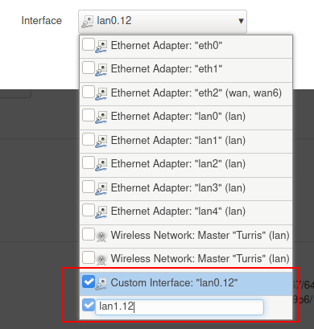
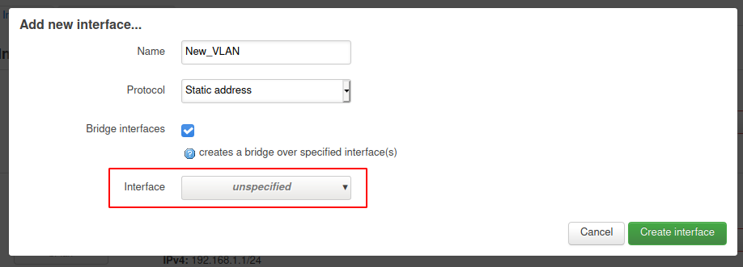
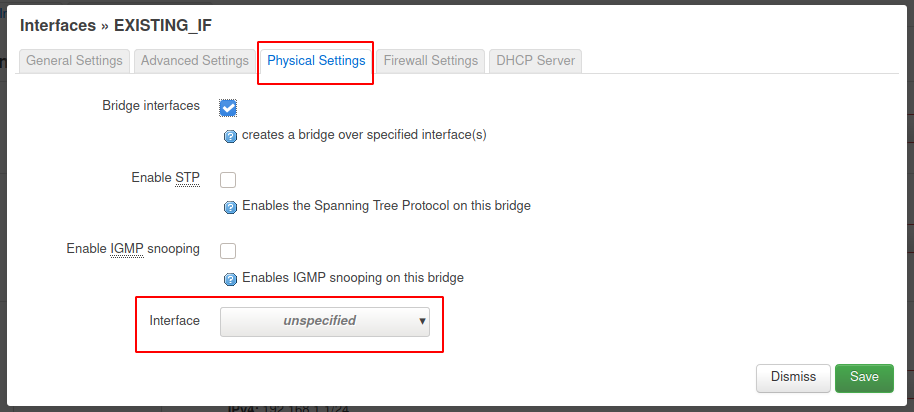

# LuCI VLAN setup

## What is VLAN?

VLAN is a short for **V**irtual **L**ocal **A**rea **N**etwork and is defined by
IEEE802.1Q[^1]. It is used to separate local networks on a single physical network.
It is done by separating the communication of each network by adding a VLAN tag
into a frame header.

An interface tagging and recieving (i.e. accepting) tagged communication is reffered
here as a VLAN tagging interface. Each of these interfaces has to be configured
to a specific VLAN ID and ports.

Further informations can be found at OpenWrt[^2]

!!! Warning
    VLAN does not add much security, the communication is not encrypted.

## VLAN interface creation

VLAN communications are set by configuration of the switch, as that it is done on
the second level of ISO/OSI model[^3]. By default a user defines interfaces using
switch interfaces (`eth0`, `eth1`, etc.), but Turris OS is using **DSA**[^4] for
managing the switch, which enables creating VLAN interfaces directly over desired
interfaces. For creating VLAN interface over a specific port use `lanX` interfaces,
but you can use also `wanX` or `ethX` for managing traffic that is not passing
throught the switch.

You can check network interfaces in the hardware documentation of Omnia[^5] and
Turris 1.0/1.1[^6].

### Creating a VLAN interface in LuCI

The VLAN interfaces are configured in the _**Network > Interfaces**_ menu.

A VLAN tagged interface can be added to an existing or new network interface bridge
in the format `<if>.X` where **`<if>`** is the desired interface (i.e. `lan0`,
`wan0` or `eth0`, etc.) and **`X`** is VLAN ID.

!!! Note
    The interface is not pre-created and you cannot find it in the drop-down list.
    It must be written manually and confirmed by pressing **Enter**

!!! Example
    Adding an interface on the port 1 of VLAN ID 12

    

#### New interface

When creating a new interface with a VLAN tagged interface, you can add the interfaces
in the window, that is shown when creating the interface.

#### Existing interface

In an existing network interface you have to edit the interface. Then select
the **Physical Settings** tab. In the opened tab add the VLAN tagged interfaces.

## References

[^1]: [802.1Q on wikipedia](https://en.wikipedia.org/wiki/IEEE_802.1Q)
[^2]: [OpenWrt VLANs](https://openwrt.org/docs/guide-user/network/vlan/switch_configuration)
[^3]: [ISO/OSI model on wikipedia](https://en.wikipedia.org/wiki/OSI_model)
[^4]: [DSA configuration](https://www.kernel.org/doc/html/latest/networking/dsa/configuration.html)
[^5]: [Turris Omnia Network interfaces](../../../hw/omnia/omnia.md#network-interfaces)
[^6]: [Turris 1.0/1.1 Network interfaces](../../../hw/turris-1x/turris-1x.md#network-interfaces)
