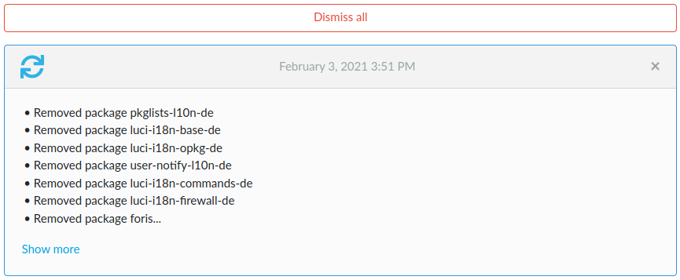
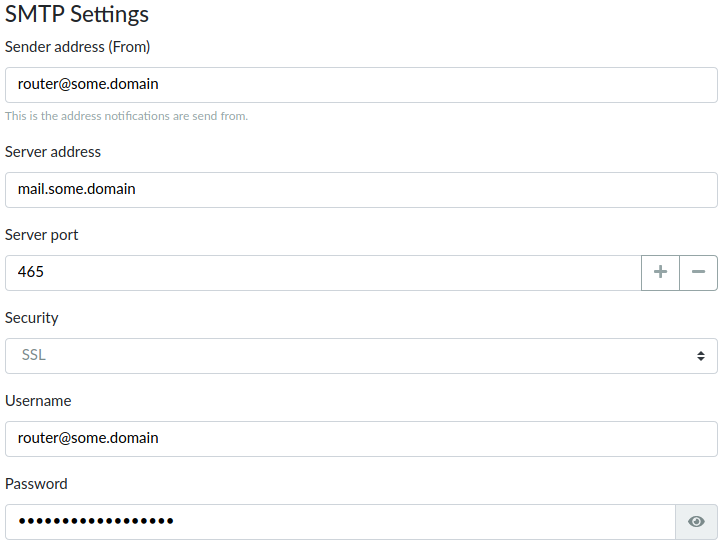

# Notifications in reForis

There are two ways how Turris OS notifies what happens. The first one is the web
interface (i.e., reForis), and the other one is e-mail. Internal notifications
in reForis are always enabled, whereas e-mail notifications have to be
explicitly enabled.

## Internal notifications in reForis

Internal notification in reForis are emitted on all important events – such
as installed or removed packages, long operations, requested reboots or
error occurred. Anywhere you are in reForis, new notifications are
indicated at the small bell in the top-right corner of the page. The
displayed number in the red disc means the number of new notifications.

If you move the mouse cursor over the bell a brief list of the notifications
is displayed. You can go to the _Notifications_ page, configure the e-mail
notifications (see below) or dismiss the notifications individually or
all at once.

All of the undismissed notifications are on the _Notifications_ page.

Here you can see the notification with their details, for example, with
all installed/removed packages, full error messages, and so on. Longer
contents are shortened and you can get their full versions by clicking
to _Show more_.

## E-mail notifications

Almost nobody checks often whether there is something important in
Turris OS. It isn't necessary to do such checks because e-mail
notifications can be configured. They are disabled by default.
These notifications can be set on _Administration -> Notification Settings_.

If you enable these notifications by checking _Enable email notifications_,
there are several parameters to be configured:

* **SMTP provider** – The Turris team provides its mail infrastructure
  to allow simple distribution of e-mail notifications. This option (_Turris_)
  is enabled by default and you may utilize it for free and without any
  restrictions. If you want to use your own mail server for some reason,
  then simply switch to _Custom_. See below for details.

* **Recipient's email** – This is the address to be used for e-mail
  notifications. It's possible to use multiple addresses; separate them by
  commas.

* **Importance** – By default, only notifications on required reboots are
  sent. It can be changed to more "verbose" options.

* **Send news** – If you check this checkbox, we will send you messages about
  new features and other essential things about the Turris project.

### Custom mail server

It's necessary to set additional parameters to use this option:

* **Sender address (From)** – It will be used as the address of the sender.
  If the delivery of a message fails it will be returned to this address.

* **Server port** – This is usually 465
  ([SMTP](https://en.wikipedia.org/wiki/Simple_Mail_Transfer_Protocol)
  with implicit [TLS](https://en.wikipedia.org/wiki/Transport_Layer_Security);
  this is the default), 25 (SMTP with explicit TLS or unsecured) or 587 (SMTP
  submission with explicit TLS or unsecured; it requires
  [authentication](https://en.wikipedia.org/wiki/SMTP_Authentication)).
  Also, you can use other port numbers in some situations.

* **Security** – It can be set to one of these three options:
    * **SSL** – Implicit TLS; is the default and most secure.
    * **STARTTLS** – Explicit TLS; use it if your server doesn't support
      implicit TLS.
    * **None** – Unencrypted communication, not recommended; use it only
      if your server doesn't support implicit nor explicit TLS.

* **Username** – The user name for SMTP authentication. Leave empty if
  authentication won't be used.

* **Password** – The password for SMTP authentication. Leave empty if you
  won't use authentication.

### Test notification

After you configure the e-mail notification mechanism, we strongly encourage to
send a test notification to ensure that all parameters have been set correctly.
Simply click to _Send testing notification_.

!!! important
    The importance level must be set at least to "Reboot or attention is
    required". After testing, you can set it to the original level back.

Then check your mailbox for the testing notification message. If it doesn't
arrive please wait approx. 30 minutes because some antispam methods like
greylisting can delay messages in some cases. If the message wouldn't come
after this period check your settings.

!!! notice
    Some of configuration errors are reported by reForis during the test.
    But even if it looks good in reForis it needn't mean that the
    configuration is correct. And vice versa, if the given server uses
    greylisting or similar antispam technology it may report an error
    even for a correct configuration. Please wait approx. 10 minutes and
    try the test again.
