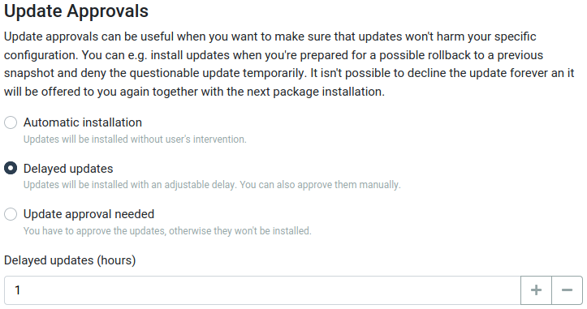

# Updates in reForis

## How Turris OS updates work

One of the most important features of Turris devices are automatic system
updates. Thanks to this function your router's software stays up to date
and offers better protection against attacks from the Internet. It is highly
recommended to have this feature turned on. If you decide to disable it,
be warned that this might weaken the security of your router and network
in case flaws in the software are found.

If automatic updates are enabled they are downloaded and installed as
soon as possible (in two-hour windows six times a day with random delays
to spread the load of the update servers). These updates may be delayed
and/or manually approved.

Some updates require restarts. These restarts are delayed (three days by
default) and planned to a specific time of day (3:30 AM by default).
The device can be rebooted manually too of course.

## Configuration in reForis

!!! important
    Configuration of updates is not available on Turris Shield. Updates
    are always enabled and are installed as soon as possible.

Updates are configured at _Package Management → Update Settings_. If you
want to disable automatic updates you can uncheck the given checkbox.
But doing this is strongly discouraged because you can miss security
patches for vulnerabilities – some of them may be exploited remotely.

The default state is that updates are installed as soon as possible.
This is usually the best approach but there are situations where
you may prefer delayed updates. For example, your device is not
exposed to the Internet and provides multiple internal services which
must not be affected by eventual bugs in updates.

This can be achieved by switching the radion button to _Delayed
updates_ and setting a suitable delay (the default is one hour).
The maximum delay is 168 hours (one week).

Even more control can be obtained by switching to _Update approval needed_.
This setting will require that each update will have to be explicitly
manually approved. It can be utilized e.g. in the above situation if you want
to minimize eventual downtime (in case that something goes wrong you could
revert the update immediately).

Automatic restarts can't be disabled at all but can be delayed (and are
always delayed respectively). The maximum delay is 10 days.

When done, press the _Save_ button to save and apply your changes.

## Manual updates

If you have disabled automatic updates or if you want to install updates
before they will be installed automatically you can utilize manual
installation. Visit _Package Management → Updates_ and then simply
press _Check and install updates_.

Your device will check for new updates. Eventually found updates will
be installed immediately.
