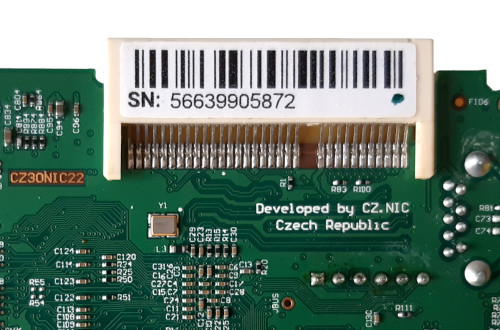

# Getting help

This section will point you to various ways of getting help with your router.

## Formulating your problem

This short manual will take you through the recommended steps when discussing
problems. Following these instructions should help to resolve your issues much
faster.

 * A suitable subject for e-mail/issue/forum post
    * Good: 5GHz Card not visible | T-Mobile PPPoE won't connect
    * Not so good: Turris Omnia problem | Problem | Omnia died
 * Use one thread per problem. Don't mix many issues into one e-mail/issue/forum post
 * Clearly state what router you have and whether you have made any HW alterations.
 * Don't forget to mention the version of your _Turris OS_! (_reForis → About_)
 * If you have logs, include them. But be aware that those **might contain
   sensitive data**.

### Obtaining the serial number

If you are contacting the official Turris support, always include your router's
serial number (S/N, SN). You can obtain it using one of these ways:

1. The _About_ tab in _reForis_.
2. The invoice or receipt issued by your vendor.
3. The label on the paper box used for packaging your router.
4. Output of the command `crypto-wrapper serial-number` **included in one
   of the diagnostic modules** (not applicable for Shield).
5. The label on the bottom of your router (applicable for Omnia and Turris 1.x).
6. The label on one of the plastic parts of your device (applicable for
   MOX and Shield – see the photo below). It's usually one of the parts on
   the top side of your device.
7. The label on the MOX bus slot of your module A (applicable for MOX and
   Shield – see the photo below).




## Getting logs

!!! warning
    If you come across any error and it is possible not to reboot the router,
    **please don't reboot it** before collecting the logs. All logs are saved in
    the router memory and they will be erased if you reboot.

If you just rebooted the router, let it gather some data first. Logs from a
freshly rebooted router, which have been downloaded before the occurrence of
the error, usually don't help us to identify the cause of the error.

### Using reForis

If you use the _reForis_ interface to maintain your router, you can
generate logs using the _Diagnostics_ page. The modules, which are usually
the most important are `disk_full`, `messages`, `dns`, `installed`, and
`network`. If the nature of the problem suggests that other modules could also
be helpful, you can check them. The required logs will be generated if you
click _Generate_ button. At the bottom of the page is a list of reports,
where the new one will be available in approximately a minute. Then you can
download it.

#### If you can't find the diagnostics

In that case, your router is, for some reason, stuck in some old version of the
_Turris OS_. That is the first problem to solve, make sure you have updates
enabled and your internet connection is working.

### Using the console

If you cannot access the web interface, you can connect via SSH and run the
diagnostics script.

!!! info
    If you do not have installed SSH support on your PC, you will need to install
    an SSH client. On Linux, it is usually `openssh-client`, and on Windows it is
    `Posh-SSH` or `WinSCP`. But many Linux distros have an OpenSSH client
    preinstalled, and also the Windows PowerShell 2.0 has it already integrated.

1. You connect to the router via SSH (using terminal, PowerShell, or another
  command-line tool).

    ```shell
    user@pc:~$ ssh root@192.168.1.1
    ```

2. Run the diagnostic script.

    ```shell
    root@192.168.1.1:~$ turris-diagnostics | gzip > /tmp/diag.gz
    ```

3. Disconnect (using `Ctrl+D`).

4. Copy the diagnostic file to your computer.
    - using SCP
        ```shell
        $ scp root@192.168.1.1:/tmp/diag.gz <your destination>
        ```

    - using an SFTP client (like Filezilla)

        In an SFTP client, create a new connection with credentials similar to
        the SSH connection:

        - **Host**: _your router IP address/hostname. By default_ `192.168.1.1`
        - **username**: `root`
        - **port**: `22`

!!! info
    We prefer to have these complete diagnostics, but if you are an experienced
    user, you can always send us only specific output of standalone diagnostics
    of components you have a problem with. But we still may insist on sending
    further diagnostic data.

## Support channels

### Documentation

The first obvious way to get help is this documentation. There is a search box
in the upper right corner and you can use that one to find more information
about a specific topic.

Apart from official documentation, we also have a [community
wiki](https://wiki.turris.cz/doc/en/public/start) where you can find guides to
some more complex setups that are not necessarily officially supported and
might or might not work.

### Forum

For help with advanced setups, you might want to check our
[forum](https://forum.turris.cz), a platform for our users to discuss themselves
and help each other even with unsupported scenarios.

### Issue tracker

Turris OS is based on OpenWrt, which is a Linux distribution. As such it contains
plenty of packages, but most of them are not maintained by Turris team. You can
find a list of packages maintained by the Turris team in the [Turris OS packages
repository](https://gitlab.nic.cz/turris/os/packages) and you can also file
issues against them there, although before that please read the [issue
submission guide](../geek/contributing/issues.md).

If you have an issue with a package not maintained by Turris team, you can file
an issue against the upstream tracker. Please read the [OpenWrt bug reporting
guide](https://openwrt.org/bugs).

### Turris support

There is official Turris support available via e-mail
[tech.support@turris.cz](mailto:tech.support@turris.cz). It is not 24/7 and it
deals with hardware issues and with serious software issues in supported
software. It will not help you design your network, nor will it fix any package
available in OpenWrt.

!!! warning
    Whenever you are contacting us via e-mail, be sure that the total size of all
    attachments won't exceed the size 14MB.
