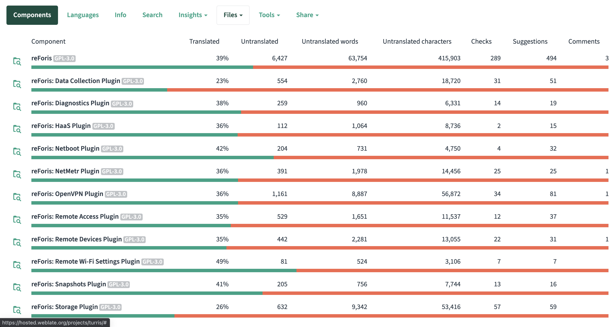
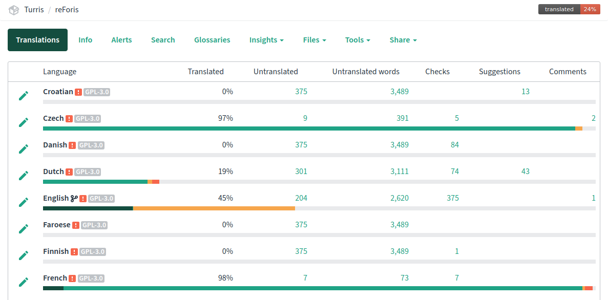
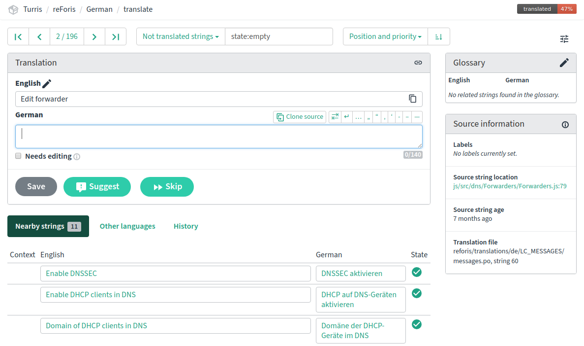

# How to Participate in the Interface Translation

We developed the Turris router interface in English, and we use Czech as the
reference localization language. But if you wish, you can [take part in
translating](https://hosted.weblate.org/engage/turris/) the interface into any
language of your choosing.

!!! tip
    You can translate the Turris-specific interface (reForis & plugins)
    and the OpenWrt interface (LuCI).

## How to translate

We use the online service [Weblate](https://weblate.org/) for the translations.
The translation is done in a web form, with the help of an integrated dictionary
and other users.

Your translation will be reviewed and merged into according repositories and
then released with a further update.

!!! note
    You also need to bear in mind that it will take some time and will be,
    probably, merged alongside minor fixes.

## Let's get started

  1. First of all, register for free with the Weblate service.
  2. Go to the page of [Turris localization
     project](https://hosted.weblate.org/projects/turris/).
  3. Choose the part of the project, which you want to translate. The interface
     is divided into several parts: reForis interface and various plug-ins.
  4. Choose the language you want to help with. If you want to translate into a
     new language choose _Start new translation_ in tab _Tools_.
  5. Choose the language you are translating into. The form contains a majority
     of current and dead languages, you will be able to choose one.
  6. The list of translations now contains the language which you have added.
     Click on the button on the right, which says _Translation_ and start
     translating the strings that aren't translated yet.
  7. When the percentage on the _Language_ screen exceeds 85, we proofread the
     translation and publish it. If you want to speak to us about the
     translations, you can use this
     [forum](https://forum.turris.cz/t/how-to-participate-at-the-foris-interface-translation)
     to do it.
  8. If a phrase is not translated, the English expression will be used.

_These parts of reForis can be translated by you_

_Languages for translation_

## Description of the translation interface

Weblate is very intuitive service and doesn’t need any special skills to use it.
The basic interface is the translation screen, where you can see the source text
and the translation itself.

_Screen for translation of expressions and terms_

The _nearby messages_ tab displays other strings with a similar sentence. You
can use it for your own translation. This option can help you in case you want
to investigate what is the usual approach to the translation (using a
polite/familiar form, infinitives, familiar tone, etc).

The _Machine translation_ tab suggests translations with automatic translators.
You can copy it to the source window and work with it, copy it, and save (in
this case another expression is proposed to you for translation).

### What is the difference between _Save_ and _Suggest_?
If you click _Save_, you are sure that the translation is correct. "Suggestion"
means you want us to proofread your translation. Weblate tracks the number of
suggestions and finally saved words.

### Zen regime
You can switch to this mode by clicking the button in the upper right corner of
the screen. The bulk translation is useful for shorter expressions which are
very useful when translating Foris/reForis interface. Every translation is used
in real-time and replaced in other parts of texts. Edit icon will let you
translate in a usual way.

Other options of Weblate (with the exception of History) are not vital to know
when translating the Foris interface.

## Please pay attention when translating

Be polite and consistent. What does that mean? For example, decide at the
beginning if you use the formal or familiar form (if this applies to your
language). We use infinitive or imperative forms for the buttons. The imperative
form seems clear and simple to us, please don't consider it a sign of being too
directive. Try to use the communication tone which is usual for computer
interfaces. Be concise and do not translate one term differently in different
places.

## Which sections can be translated

We would love your help with these sections:

  * **reForis** – main language interface for web administration of Turris (it
    supersedes the older Foris)
  * **reForis: Data Collection Plugin** – plugin for Sentinel dynamic firewall
  * **reForis: Diagnostics Plugin** – plugin for Turris diagnostics
  * **reForis: Netboot Plugin** – plugin for booting over networks
  * **reForis: OpenVPN Plugin** – plugin for the simpler setting of the OpenVPN
    server
  * **reForis: Remote Access Plugin** – plugin for generating QR codes for
    mobile access, etc.
  * **reForis: Remote Devices Plugin** – plugin for managing remote devices
  * **reForis: Remote Wi-Fi Settings Plugin** – plugin for remote Wi-Fi settings
    management
  * **reForis: Snapshots Plugin** – plugin for managing filesystem snapshots

## Community of translators

We are very thankful to everybody who contributes to the translation. For
communication about translation use [this forum](https://forum.turris.cz/).
