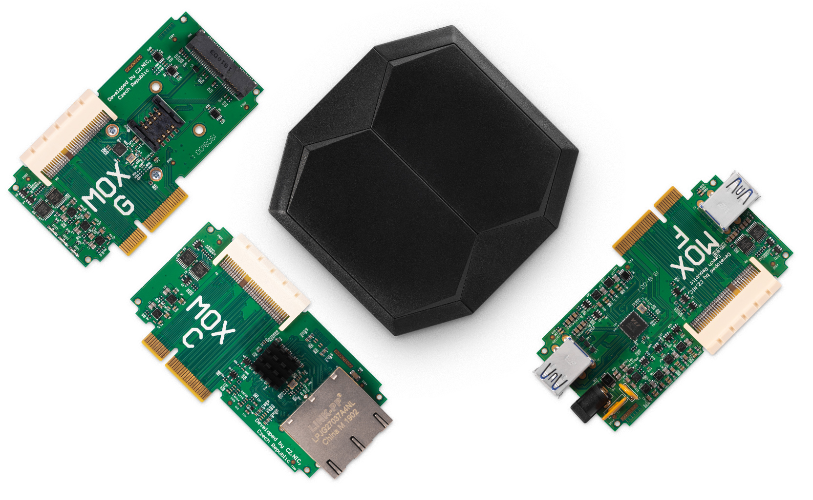

# About

The Turris MOX is a unique modular router suitable for small and medium
enterprises, geeks and the households of all users who are aware of the
internet’s risks. Thanks to its secure default configuration, automatic
firmware updates and adaptive distributed firewall, the product is very secure.
The Turris MOX is also open source – it runs a free Linux operating system
(based on OpenWrt).

## How it works?

If you want something ready to go, you can get a Turris MOX as a complete set.
[Pocket Wi-Fi](sets/pocketwifi.md) and [Power Wi-Fi](sets/powerwifi.md) are for
completely wireless solution but configuration is a little bit trickier due to
only one Ethernet port. The easiest to configure and the most common
configuration is [Classic](sets/classic.md). That one contains both Wi-Fi and
several Ethernet ports and thus is much easier to configure.

For more advance use-cases, you might want to build your own MOX. For that you
will need the basic set [MOX Start](sets/start.md), decide what you need and pick
from the list of modules and add-ons how to extend it.

### List of modules and add-ons

* [MOX B](modules/b.md) - mPCIe port
* [MOX C](modules/c.md) - 4 port Ethernet switch
* [MOX D](modules/d.md) - SFP
* [MOX E](modules/e.md) - 8 port Ethernet switch
* [MOX F](modules/f.md) - 4 USB 3.0 ports
* [MOX G](modules/g.md) - pass-through mPCIe port
* [MOX Wi-Fi add-on (SDIO)](addons.md#wi-fi-sdio) - dual-band SDIO Wi-Fi and Bluetooth card
* [MOX Wi-Fi add-on (mPCIe)](addons.md#wi-fi-mpcie) - dual band mPCIe Wi-Fi card (faster)
* [MOX PoE add-on](addons.md#poe) - 802.3at and 802.3af compliant module to power up the MOX

### Official brochure

We also have an official brochure with basic information about MOX and various
modules, typically available on conferences and through our distributors. If
you prefer one simple document explaining MOX over complex and detailed
documentation, you can download it here.

[MOX Brochure](MOX_Brochure.pdf)

## Related documentation

Once you have Turris MOX, there are few additional things that you might want
to read. Here is just a short list, more information can be found in this whole
site.

* [MOX First setup](../../basics/first-setup/mox_first_setup.md)
* [Turris OS Highlights](../../basics/highlights.md)
* [MOX hardware details](hw.md)
* [Early access to development versions](../../geek/testing.md)
* [MOX rescue modes](rescue_modes.md)
