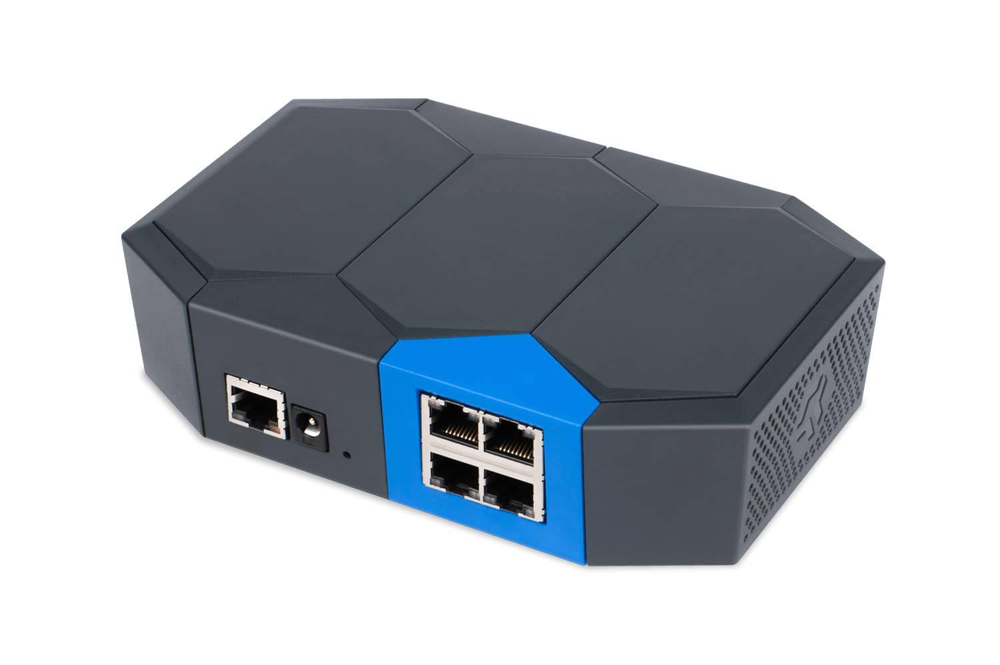

# Turris Shield

Turris Shield is a single-purpose device for everyone who wants to easily
secure their entire home or office without having to change their modem or
router.

Hardware-wise it is based on [Turris MOX](../mox/intro.md). The main
difference is software and target audience.  While MOX is trying to be as
customizable as possible, Shield on the other hand tries to be as simple as
possible while still being secure.

## Software

Turris Shield comes with Turris OS with several important tweaks by default.
Setup guide is simplified to just entering your password which is immediately
offline (without ever leaving the router) checked against the list of passwords
collected from recorded attacks. From that moment onward, you are good to go
and can connect to the Internet.

Turris Shield is also the first device to feature reForis user interface by
default. It does not contain LuCI nor Foris. Automatic updates are enabled by
default as is [Turris Sentinel](../../basics/collect.md) - key feature of
Turris Shield.

Other features readily available include support for DNSSEC, OpenVPN (both
server and client) or for example automatic notification of newly connected
devices.

## Available documents

 * [Declaration of Conformity](Shield_DoC.pdf)
 * [Official datasheet](shield_datasheet.pdf)
 * [Official printed manual](shield_manual.pdf)

Schematics for modules that Turris Shield consists of are available:

 * [MOX A](../mox/Turris_Mox_A.pdf)
 * [MOX C](../mox/Turris_Mox_C.pdf)
