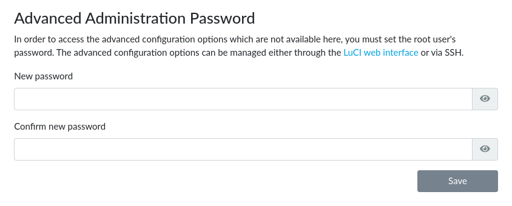

# Passwords in Turris OS

Passwords are an important part of security of operating systems. This article
describes how Turris OS works with passwords and which security measures
are used.

## About passwords

In general, Turris OS has two distinct classes of passwords:

* one password for Foris and reForis,
* user-related passwords for other purposes (e.g. LuCI and SSH); ie. system
  passwords.

These passwords are set separately but Foris and reForis can set the same
password for Foris/reForis and for the `root` user (see below).

Unlike some other routers, Turris has no default nor hard-coded passwords.
The Foris/reForis password is originally set in the first start guide.
System passwords need not be set there but you won't be able to log into LuCI
nor access your router via SSH if no password is set for the `root` user.

## How passwords are stored and secured

### Foris/reForis password

The Foris/reForis password is stored as the `auth.password` configuration
option in `/etc/config/foris`. It is stored as a
[salted](https://en.wikipedia.org/wiki/Salt_(cryptography))
[hash](https://en.wikipedia.org/wiki/Hash_function) using
[PBKDF2](https://en.wikipedia.org/wiki/PBKDF2) as its algorithm
(currently with 1000 iterations).

### System passwords

System passwords are stored using the same method as common Linux
distributions do: in `/etc/shadow` together with their user names.
These passwords are stored as salted hashes; the hashing
algorithm is currently
[SHA-512](https://en.wikipedia.org/wiki/SHA-2)
but it can be changed in the future.

## How to change passwords

### Foris/reForis password

Select _Administration → Password_ in the menu. Write the current
password and the new password. The new password should be
[strong](https://en.wikipedia.org/wiki/Password_strength#Guidelines_for_strong_passwords).

### System passwords

You can use the same password as for Foris/reForis. See the dialog above; check
_Use the same password..._ to ensure this. If you want to set a different
password you can fill the second dialog at the same page.

!!! notice
    Fill _Current password_ in the previous dialog too. Without this
    password, your request to change the system password will be denied.

It can be also set via LuCI or via `passwd` in the command line. It is also
possible to create additional users and set their password using standard
command line commands like `useradd`.

!!! warning
    There are two different versions of `passwd`. The one from Busybox which
    is always installed is in `/bin/passwd` and hashes passwords by SHA-512.
    But if you install the standard GNU version it will be installed to
    `/usr/bin/passwd` and will hash passwords by PBKDF2. This version will
    have preference thus passwords set by simply `passwd` will be hashed
    by PBKDF2.
