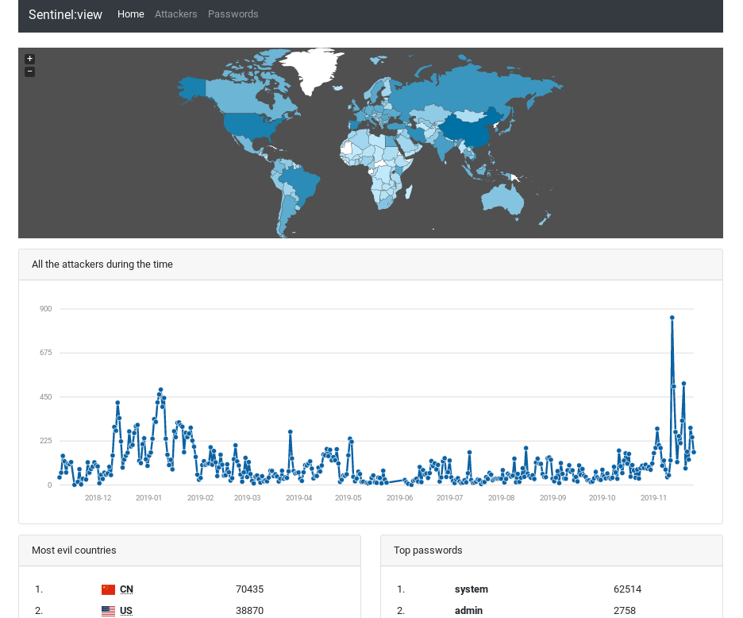
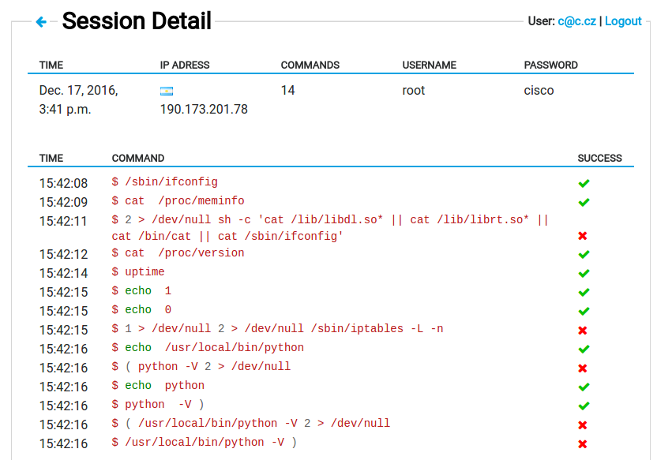

# Data Collection

## Why enable Data Collection?

One of the initial motives that led to the development of the Turris router was
to set up a secure home router that is capable of responding to current threats
in almost real time. However a large amount of data is needed to identify an
attacker and distinguish it from the usual traffic.

The data collection system [Sentinel](apps/sentinel.md) is a key source of such a data. We use this
data to build
and distribute a dynamic firewall which afterwards helps to keep your router secure.
Enabling data collection thus helps to protect your own router (and home) as well
as to protect the rest of the world.

## What data do we collect?

There are multiple source of data we collect. Depending on the source used, the
type of data varies.

## Can I see the data?

You can browse the data we have collected through the Sentinel network on our
web called [Sentinel View](https://view.sentinel.turris.cz/). You can browse
there detected attackers, their favorite passwords, country of origin and such.



### Firewall monitoring

Firewall data is one of the key data sources for [Sentinel](apps/sentinel.md). Using firewall data
we can determine which attackers tries to exploit potential vulnerabilities on
a particular port. We collect attacker IP address and local port number.

### Minipot

The word "Minipot" is a combination of the words "mini" and "Honeypot", where
Honeypot, also called a fake server, is a way to mimic some kind of service,
usually attractive to a potential attacker.

Turris Minipot is a lightweight Honeypot which emulates only minimal subset of
each protocol, answering "bad password" to each attempt to log in. We currently
operate telnet Minipots. The entered user/password combination along with
the attacker's IP address is collected by the software.

## How to set up data collection?

The whole functionality is nowadays provided by [Sentinel](apps/sentinel.md).
To get at least the basics going is to enable _Data collection_ software set in
_Updater_ tab. This will install dynamic firewall and in later version (not
available at the moment) also additional tab in Foris to control what data you
want to collect and contribute.

Enabling _Data collection_ list will install and enable dynamic firewall. To
install additional software you can use either [LuCI](luci/luci.md)
or ssh to install `sentinel-minipot` and `sentinel-nikola` packages.

In CLI you can do so by running the following commands:

```
opkg update
opkg install sentinel-nikola sentinel-minipot
```

Currently there is no way to visualize what your router is collecting, it is
being worked on, but you can see overall statistics from all routers on
[Sentinel View](https://view.sentinel.turris.cz)

### HaaS - Honeypot as a Service

Currently the only way how to enable Honeypot as a service is from ssh after
registering on our website - [HaaS.nic.cz](https://haas.nic.cz). Get your
account there and in section _My Honeypot_ click on _Add new device_. After
naming it, you will get a **token** to be used to send data.


Next step is to set it up on your router. To do so, you need to login to it via
ssh and type in the following commands:

```
opkg update
opkg install haas-proxy
uci set haas.settings.token="YOUR_TOKEN"
uci commit haas.settings.token
/etc/init.d/haas-proxy start
```

Now sit and wait and if you have public IPv4 attackers should be showing in
short while in your statistics page on [HaaS project
website](https://haas.nic.cz).


