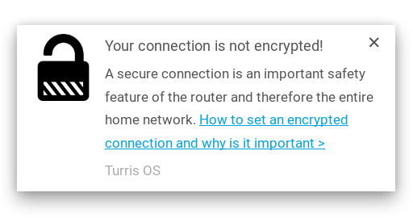
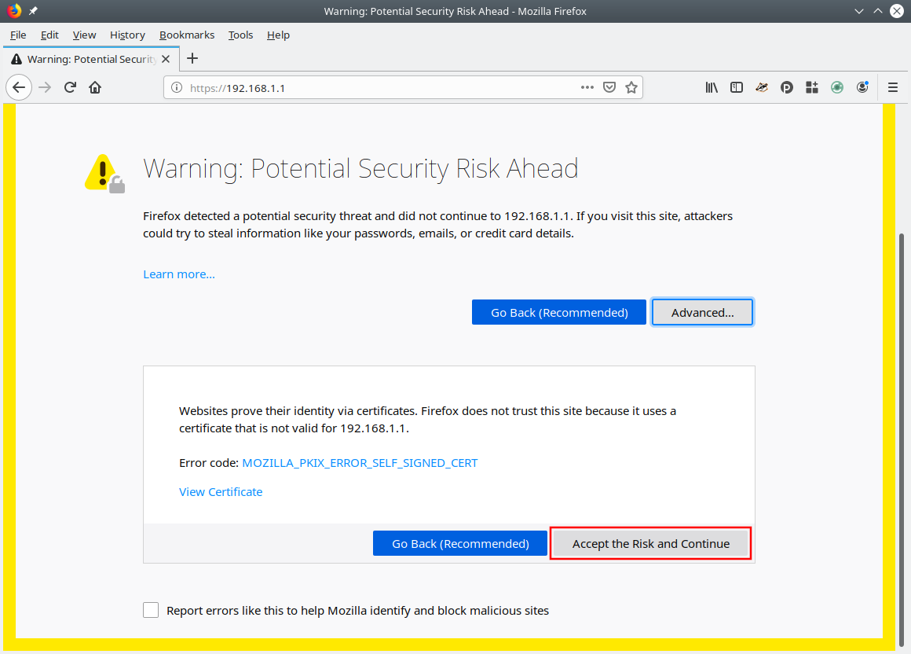

# Accessing Foris via HTTPS

If you see warning box bellow in your Foris web interface, you should add a
permanent certificate exception in your browser. Read on to find out what the
warning means and how to add the permanent certificate exception to suppress
this warning.

## What does this warning mean?

In order to safely configure your router, you need a secure channel.  If you
don't want to use just your ethernet cable to connect to your router, **a safe
way is to use HTTPS**. Why is HTTPS safe? For one, HTTPS requires a **trusted
certificate** and if the certificate is not trusted, then warnings are
displayed. We use **self-signed certificates**, which are generated on
factory-reset and cannot, unfortunately, be trusted before the first visit to
Foris and it is recommended to **add a permanent exception in your browser**
for the certificate to be trusted in future connections.

## More about warnings

!!! warning
    Do not blindly skip untrusted certificate errors. There are there for a
    good reason and might be indication of an attack attempt.

Generally, if a warning is displayed on the web page where you happen to be,
**do not proceed!** It is possible that someone simply misconfigured the web
server but there could also be an **ongoing attack**. In case this happens, use
a different device or browser. If that doesn't help, use a different channel to
configure your router or wait for a bit. A few minutes are **not worth your
passwords, card number or any other data!** If you decide to continue to the
web page, you should know exactly what you are doing. Adding the exception for
Foris is one of a little cases where this way is suitable.

## Adding a permanent exception

The certificate is generated on factory reset so you need to add or change the
exception each time you take the router back to factory settings.

!!! tip
    We strongly recommend to use Mozilla Firefox for configuration of your
    Turris because it has the simplest process to save the exception.
    Furthermore it is a free browser (free both as in speech and as in beer),
    it is secure, easily extendable by plugins and is available on all common
    platforms.

Here is the guide for Mozilla Firefox on any platform (as of the version 67
released in May 2019):

1. When you open the Foris page for the first time this warning is displayed:

2. Press the _Advanced..._ button to display more details:

3. Press the _Accept the Risk and Continue_ button now. The exception is
   saved and the browser will no longer show the warning text.
